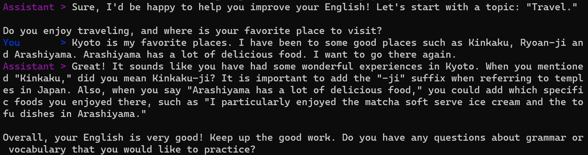

# Ecgpt

This is a "English Conversation/Chat CLI Tool using GPT model."

You can chat with AI assistant and improve your english conversation skills using this tool.



# Installation

There are two ways to install.

## 1. Homebrew (recommend)

Install

```
brew install ryuichi-maeda/tap/ecgpt
```

Upgrade

```
brew upgrade ryuichi-maeda/tap/ecgpt
```

Uninstall

```
brew uninstall ecgpt
```

## 2. [GitHub Release page](https://github.com/ryuichi-maeda/ecgpt/releases).
   1. Download right compressed folder for your environment from the release page.
   2. Extract the downloaded compressed folder.
   3. Move the exec file (ecgpt.exe) to a directory with a PATH through it.

# Usage

## help

```
$ ecgpt help
This is a English Conversation/Chat CLI Tool using GPT model.
If you want to use this CLI tool, you have to set OpenAI API Key using 'ecgpt configure' command at first.

Usage:
  ecgpt [command]

Available Commands:
  chat        Chat with AI assistant
  completion  Generate the autocompletion script for the specified shell
  configure   Set a OpenAI API Key
  help        Help about any command
  history     Check past conversations

Flags:
  -h, --help     help for ecgpt
  -t, --toggle   Help message for toggle

Use "ecgpt [command] --help" for more information about a command.
```

## configure

Set your OpenAI API key. You can get API keys from https://platform.openai.com/account/api-keys, but an OpenAI account is required.

Here is an example.

```
$ ecgpt configure
✔ OpenAI API Key: Enter your API key here
```

## chat

You can chat with AI assistant. If the assistant finds areas for improvement in your English writing, the assistant will advise you.

If you want to finish the conversation, please enter **exit**.

Here is an example.

```
$ ecgpt chat
Assistant > Hello! How are you doing today? If you need any help with improving your English, feel free to ask me anything.
You       > I'm good but play the guiter
Assistant > Great to hear that you're doing well! I noticed a small mistake in your sentence. You should say "I'm good, I play the guitar." instead of "I'm good but play the guiter." Also, to help you with your English, it would be better to say "I play guitar" instead of "I play the guitar". When we talk about playing a musical instrument, we usually use it without "the". Keep up the good work!
You       > exit
```

## history

You can check the contents of past conversations.

Here is an example. 

```
$ ecgpt history
Use the arrow keys to navigate: ↓ ↑ → ← 
? Select a history: 
    2023-03-28_11:47:30_Discussion_on_travel,_dream_vacation_spot_mentioned_is_Bali,_Indonesia.
  ▸ 2023-03-28_22:02:12_Travel:_America,_California,_Disneyland,_Golden_State_Bridge,_Google_Headquarters,_volleyball.
```

You can select and check the contents.

# License

Ecgpt is released under the MIT license. See [LICENSE](./LICENSE).
